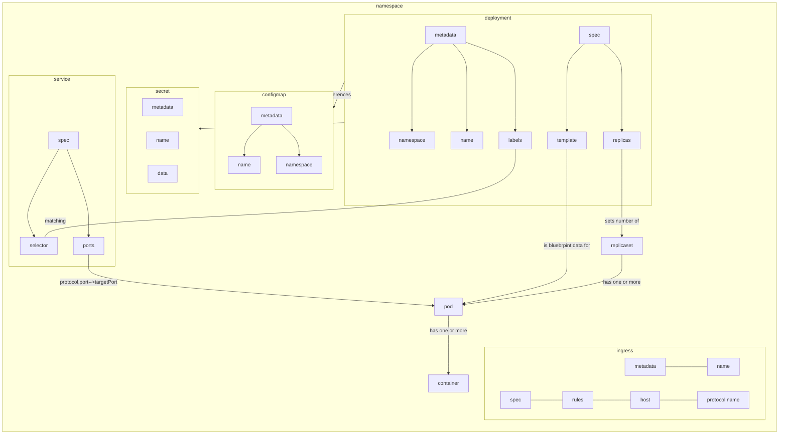

```asciiart


       ┌────────────────────────────┐
       │        ingress             │
       ├────────────────────────────┤
       │metadata                    │
       │  name                      │
       │spec                        │
       │  rules                     │
       │    host                    │
       │      protocol name         │
       └────────────────────────────┘


                                     ┌─────────────────┐
                                     │    service      │
                                     │─────────────────│
                                     │spec             │
       ┌─────────────────────┐       │  ports          │
       │     deployment      │       │    - protocol   │
       ├─────────────────────┤       │      port       │
       │metadata             │       │      targetPort─┼───────────────────────────────┐
       │  labels─────────────┼───────┼─►selector       │                               │
       │  name               │       └─────────────────┘                               │
       │  namespace          │                                                         │
       │spec                 │           sets number of      ┌──────────┐              │
       │  replicas───────────┼──────────────────────────────►│replicaset│              │
       │  template───────────┼───────────────────────┐       └─────┬────┘              │
       └─┬────────────────┬──┘                       │             │ has one or more   │
         │                │                          │             │                   │
         │references      │references                │             ▼                   │
         │                │                          │ describes ┌───┐                 │
         ▼                ▼                          └──────────►│pod│◄────────────────┘
   ┌──────────┐       ┌─────────────┐                            └─┬─┘
   │  secret  │       │  configmap  │                              │
   ├──────────┤       ├─────────────┤                              │ has one or more
   │metadata  │       │metadata     │                              │
   │name      │       │  name       │                              ▼
   │data      │       │  namespace  │                          ┌─────────┐
   └──────────┘       └─────────────┘                          │container│
                                                               └─────────┘

```

**namespace**s isolate/partition kubernetes entities into parts which are from a kubernetes view to be managed seperately  
which does not mean pods in different namespaces can't communicate but  
e.g. that they are not using the same *config map*s, *secret*s though  
*configmap*s of a namespace can point to an address in another namespace thus contacting *service*s in other namespaces.  
Access and resource limitation works via namespaces.  
*Volume*s and *node*s are not namespaced.  
`kubectl get namespace` lists all namespaces  
`kubectl create namespace konoha_ns` or a section in *config map*s create namespaces. 


**ingress**es map uris (domain name + protocol + port + path; spec.-host.*protocol*.paths.-backend, where *protocol* is the used protocol for the connection between the ingress and the service)  
to services (by the services name and port)


---

get kubernetes on your servers running by following instructions on https://kubernetes.io/docs/setup/production-environment/tools/kubeadm/install-kubeadm/


command cache:

kubectl apply \
   -f ./service.yaml \
   -f ./secret.yaml \
   -f ./deployment.yaml \
   -f ./configmap.yaml \
   -f ./mongo-express/service.yaml \
   -f ./mongo-express/deployment.yaml

clear; kubectl get all

>kubectl delete deployment mongodb-d mongodb-express-d; \
>kubectl delete configmap mongodb-c; \
>kubectl delete service mongodb-s mongodb-express-s; \
>kubectl delete secret mongodb-sec;

---

to run kubernetes in a docker container
`docker run --privileged --name k3s -d -e K3S_TOKEN=mynodetoken rancher/k3s:v1.27.9-k3s1 server`
