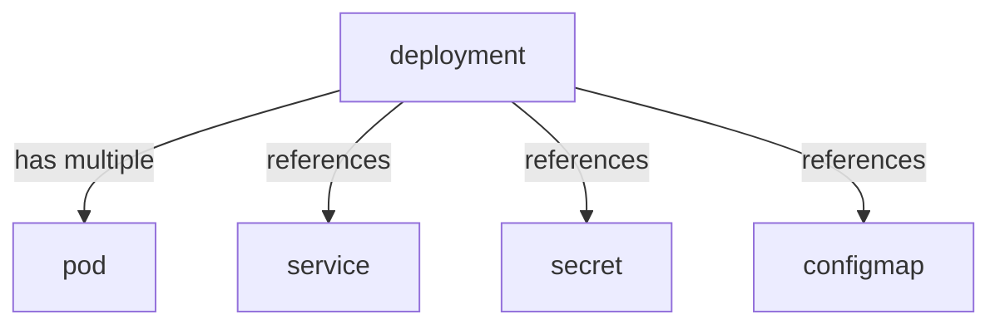

next up config map

command cache (windows):  

kubectl apply -f .\service.yaml -f .\secret.yaml -f .\deployment.yaml -f .\configmap.yaml -f .\mongo-express\service.yaml -f .\mongo-express\deployment.yaml  

clear; kubectl get all  

kubectl delete deployment mongodb-d mongodb-express-d; kubectl delete configmap mongodb-c; kubectl delete service mongodb-s mongodb-express-s; kubectl delete secret mongodb-sec;